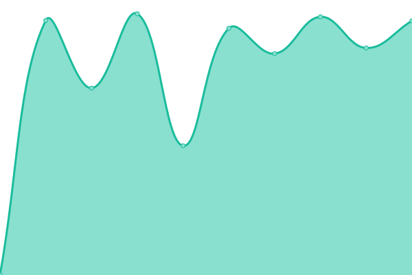

# [📈 Live Status](https://demo.upptime.js.org): <!--live status--> **🟧 Partial outage**

This repository contains the open-source uptime monitor and status page for [Upptime](https://upptime.js.org), powered by [Upptime](https://github.com/upptime/upptime).

With [Upptime](https://upptime.js.org), you can get your own unlimited and free uptime monitor and status page, powered entirely by a GitHub repository. We use [Issues](https://github.com/upptime/upptime/issues) as incident reports, [Actions](https://github.com/upptime/upptime/actions) as uptime monitors, and [Pages](https://demo.upptime.js.org) for the status page.

<!--start: status pages-->
<!-- This summary is generated by Upptime (https://github.com/upptime/upptime) -->
<!-- Do not edit this manually, your changes will be overwritten -->
<!-- prettier-ignore -->
| URL | Status | History | Response Time | Uptime |
| --- | ------ | ------- | ------------- | ------ |
|  [Miao Stay Blog](https://miaostay.com) | 🟩 Up | [miao-stay-blog.yml](https://github.com/ModerEAS/upptime/commits/HEAD/history/miao-stay-blog.yml) | 

 1454ms
     
 | 

<a href="https://status.miaostay.com/history/miao-stay-blog">100.00%</a>
    

|  [Miao Stay Games](https://flash.miaostay.com) | 🟩 Up | [miao-stay-games.yml](https://github.com/ModerEAS/upptime/commits/HEAD/history/miao-stay-games.yml) | 

 175ms
     
 | 

<a href="https://status.miaostay.com/history/miao-stay-games">100.00%</a>
    

|  [Miao Stay Books](https://books.miaostay.com) | 🟩 Up | [miao-stay-books.yml](https://github.com/ModerEAS/upptime/commits/HEAD/history/miao-stay-books.yml) | 

 2416ms
     
 | 

<a href="https://status.miaostay.com/history/miao-stay-books">100.00%</a>
    

|  [Miao Stay CI](https://ci.miaostay.com) | 🟩 Up | [miao-stay-ci.yml](https://github.com/ModerEAS/upptime/commits/HEAD/history/miao-stay-ci.yml) | 

 1063ms
     
 | 

<a href="https://status.miaostay.com/history/miao-stay-ci">100.00%</a>
    

|  [MiBlogger](https://miaostay.blogspot.com) | 🟩 Up | [mi-blogger.yml](https://github.com/ModerEAS/upptime/commits/HEAD/history/mi-blogger.yml) | 

 132ms
     
 | 

<a href="https://status.miaostay.com/history/mi-blogger">100.00%</a>
    

|  [Miao Stay Bitwarden](https://bitwarden.miaostay.com) | 🟩 Up | [miao-stay-bitwarden.yml](https://github.com/ModerEAS/upptime/commits/HEAD/history/miao-stay-bitwarden.yml) | 

 833ms
     
 | 

<a href="https://status.miaostay.com/history/miao-stay-bitwarden">100.00%</a>
    

|  [Miao Stay Jellyfin](https://jellyfin.miaostay.com) | 🟥 Down | [miao-stay-jellyfin.yml](https://github.com/ModerEAS/upptime/commits/HEAD/history/miao-stay-jellyfin.yml) | 

 2121ms
     
 | 

<a href="https://status.miaostay.com/history/miao-stay-jellyfin">100.00%</a>
    

|  [Miao Stay Seedbox](https://sbpar.miaostay.com) | 🟩 Up | [miao-stay-seedbox.yml](https://github.com/ModerEAS/upptime/commits/HEAD/history/miao-stay-seedbox.yml) | 

 476ms
     
 | 

<a href="https://status.miaostay.com/history/miao-stay-seedbox">100.00%</a>
    

|  [Miao Stay Paris](https://par.miaostay.com) | 🟩 Up | [miao-stay-paris.yml](https://github.com/ModerEAS/upptime/commits/HEAD/history/miao-stay-paris.yml) | 

 538ms
     
 | 

<a href="https://status.miaostay.com/history/miao-stay-paris">100.00%</a>
    

|  [Miao Stay Grafana](https://grafana.miaostay.com) | 🟩 Up | [miao-stay-grafana.yml](https://github.com/ModerEAS/upptime/commits/HEAD/history/miao-stay-grafana.yml) | 

 698ms
     
 | 

<a href="https://status.miaostay.com/history/miao-stay-grafana">100.00%</a>
    

<!--end: status pages-->

[**Visit our status website →**](https://demo.upptime.js.org)

## 📄 License

- Powered by: [Upptime](https://github.com/upptime/upptime)
- Code: [MIT](./LICENSE) © [Upptime](https://upptime.js.org)
- Data in the `./history` directory: [Open Database License](https://opendatacommons.org/licenses/odbl/1-0/)
